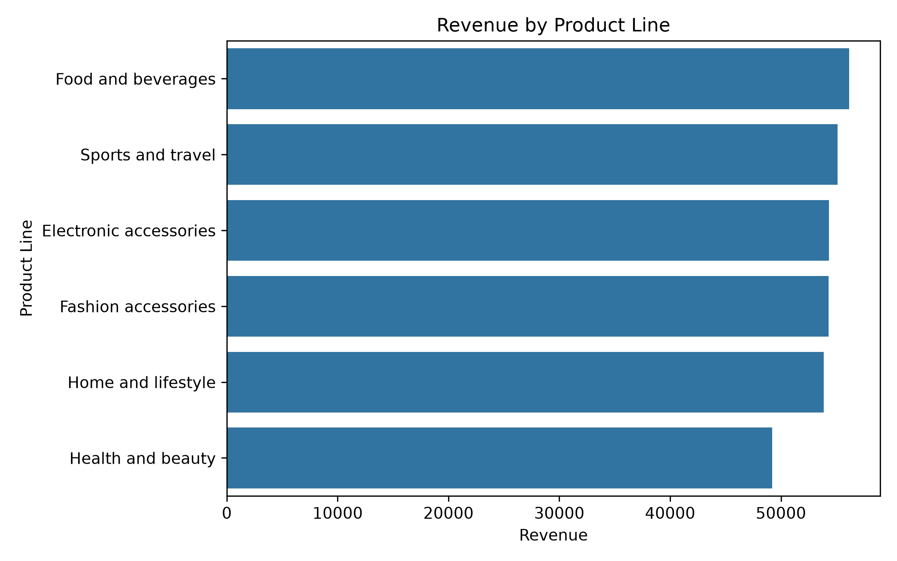
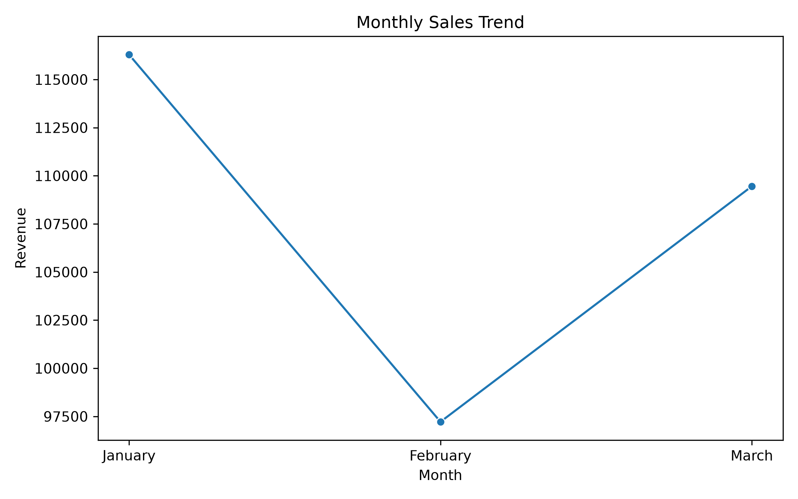
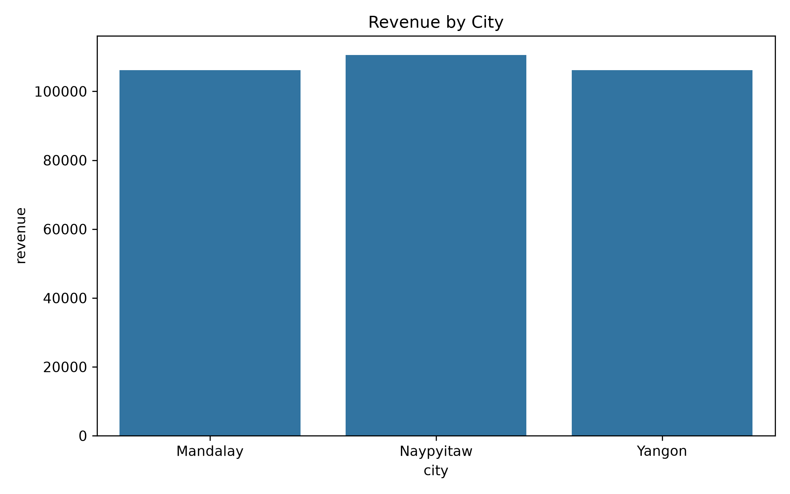
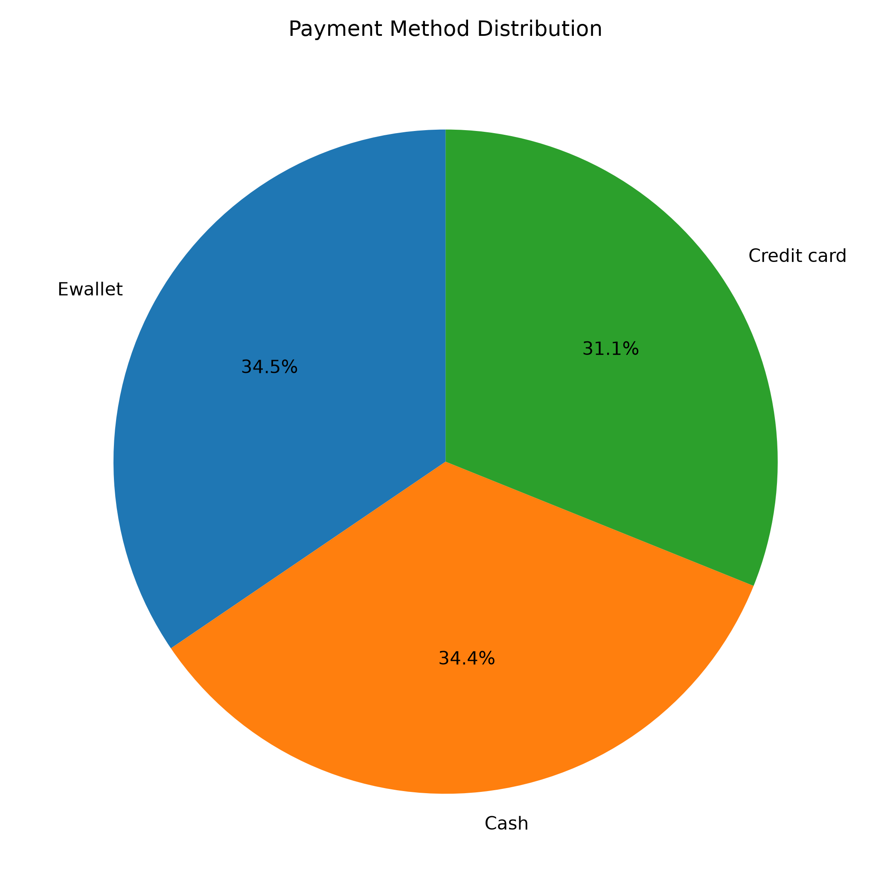
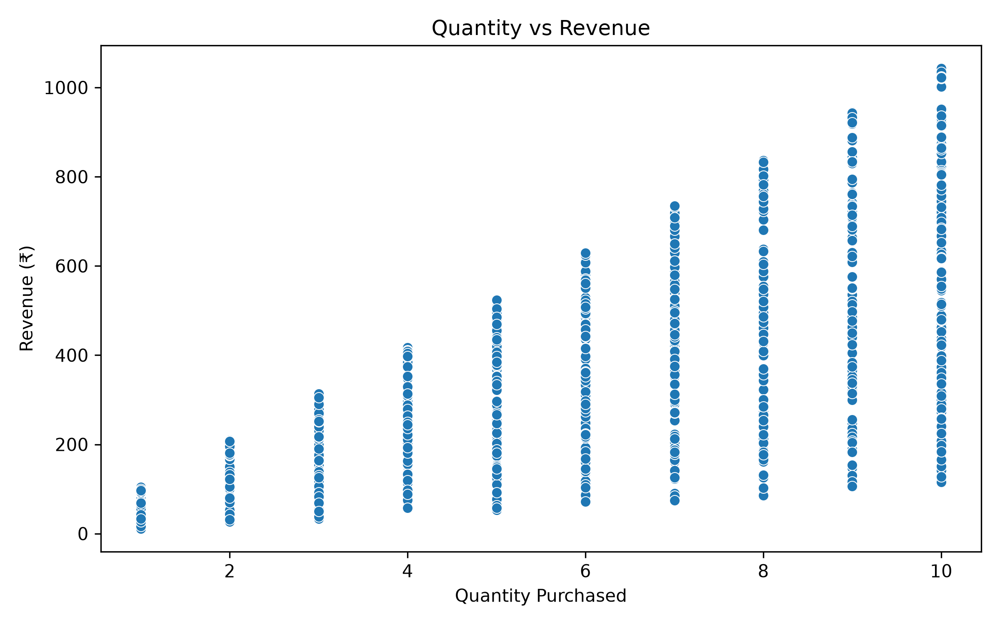

# 📊 Supermarket Sales Analysis using Python

<p align="center">


</p>

---

## 📌 Project Overview

This project analyzes a **Supermarket Sales Dataset** using **Python, Pandas, Matplotlib, and Seaborn** to extract meaningful business insights.

The project focuses on answering important business questions, analyzing customer purchasing behavior, identifying top-performing products and branches, and visualizing sales trends through interactive charts.

---

## 🎯 Objectives

- Clean and preprocess raw sales data
- Perform exploratory data analysis (EDA)
- Answer real-world business questions
- Create meaningful visualizations
- Generate business insights from sales data

---

# 🛠️ Technologies Used

| Technology | Purpose |
|------------|---------|
| Python | Programming Language |
| Pandas | Data Cleaning & Analysis |
| Matplotlib | Data Visualization |
| Seaborn | Statistical Visualization |

---

# 📂 Dataset Information

| Attribute | Value |
|----------|-------|
| Dataset | Supermarket Sales |
| Records | 1000 |
| Features | 20 |

---

# 📈 Business Questions Solved

✔ Total Revenue

✔ Total Gross Income (Profit)

✔ Average Customer Rating

✔ Highest Revenue Generating Branch

✔ Highest Revenue Generating City

✔ Highest Revenue Product Line

✔ Highest Rated Product Line

✔ Product Line with Highest Quantity Sold

✔ Male vs Female Customer Spending

✔ Member vs Normal Customer Spending

✔ Most Preferred Payment Method

✔ Highest Sales Month

✔ Peak Sales Hour

✔ Quantity vs Revenue Analysis

✔ Branch with Highest Customer Rating

---

# 📷 Project Visualizations

### 📊 Revenue by Product Line


### 📈 Monthly Sales Trend


### 🏙 Revenue by City


### 🥧 Payment Method Distribution


### 🔵 Quantity vs Revenue


---

# 💡 Key Business Insights

- 🏆 Branch **C** generated the highest revenue.
- 🏙 **Naypyitaw** recorded the highest city revenue.
- 🛒 **Food and Beverages** generated the highest revenue.
- 📦 **Electronic Accessories** sold the highest quantity.
- 📅 **January** recorded the highest sales.
- ⏰ Peak sales occurred at **19:00**.
- 💳 **Ewallet** was the most preferred payment method.
- ⭐ Branch **C** achieved the highest average customer rating.

---

# 📊 Results Summary

| Metric | Result |
|--------|--------|
| Total Revenue | ₹322,966.75 |
| Total Profit | ₹15,379.37 |
| Average Customer Rating | 6.97/10 |
| Best Branch | C |
| Best City | Naypyitaw |
| Best Product Line | Food and Beverages |
| Most Preferred Payment | Ewallet |
| Peak Sales Hour | 19:00 |

---

# 📁 Project Structure

```text
Supermarket-Sales-Analysis/
│
├── graphs/
│   ├── monthly_sales_trend.png
│   ├── payment_method_distribution.png
│   ├── quantity_vs_revenue.png
│   ├── revenue_by_city.png
│   └── revenue_by_product_line.png
│
├── supermarket_sales.csv
├── supermarket_sales_analysis.py
├── requirements.txt
└── README.md
```

---

# 🚀 How to Run

### 1️⃣ Clone the Repository

```bash
git clone https://github.com/karanalkunte20-jpg/Supermarket-Sales-Analysis.git
```

### 2️⃣ Move into the Project Folder

```bash
cd Supermarket-Sales-Analysis
```

### 3️⃣ Install Dependencies

```bash
pip install -r requirements.txt
```

### 4️⃣ Run the Project

```bash
python supermarket_sales_analysis.py
```

---

# 🎓 Learning Outcomes

Through this project, I gained practical experience in:

- Data Cleaning
- Feature Engineering
- Exploratory Data Analysis (EDA)
- Business Data Analysis
- Data Visualization
- Business Insight Generation
- Pandas Operations
- GroupBy & Aggregation
- Matplotlib & Seaborn

---

# 👨‍💻 Author

## Karan Alkunte

Engineering Student | Python | SQL | Data Analytics

GitHub: **https://github.com/karanalkunte20-jpg**

---

## ⭐ If you found this project useful, consider giving it a Star!
